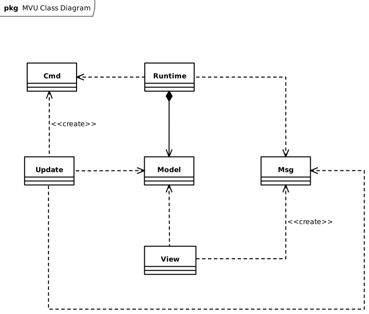
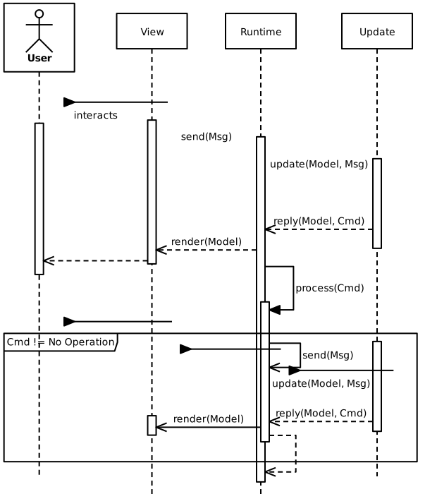

# Design architetturale

A fronte del requisito critico **[4.1]**, il gruppo ha deciso di adottare il pattern architetturale MVU (Model View Update). Esso è basato sulle seguenti componenti principali:

- Model: rappresenta lo stato del sistema;
- View: rappresenta ciò con cui interagisce l'utente;
- Message: rappresenta un messaggio scambiato internamente per l'aggiornamento dello stato;
- Command: messaggio che può richiedere una computazione e il cui risultato può generare ulteriori messaggi;
- Update: entità che utilizza un messaggio e il model per creare una versione aggiornata di quest'ultimo secondo il messaggio e, eventualmente, un comando.

// TODO: aggiungere i metodi dentro le componenti (es. update dentro Update)

La View genera dei Message in risposta agli input dell'utente; essi vengono passati a Runtime (il programma), che usa Update per ricevere il Model aggiornato ed eventualmente il prossimo comando da eseguire. Infine, Runtime invia il Model aggiornato alla View che ne esegue il render.
Il seguente diagramma di sequenza rappresenta quanto appena descritto:

[Indice](../index.md) | [Indietro](../3-requirement-specification/index.md) | [Avanti](../5-detailed-design/index.md)