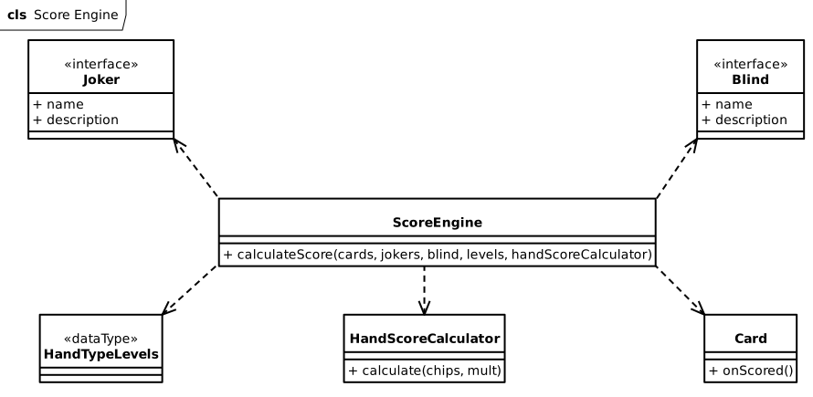

# Design di dettaglio

## Dati di gioco

### GameState

All'interno del sistema c'è la necessità di rappresentare alcune informazioni che persistono tra un round e l'altro. Queste informazioni sono raggruppate all'intern di _GameState_ e riguardano:
- le carte di cui è composto un Deck;
- dimensione della mano;
- numero di giocate e scarti per ogni round;
- informazioni sul blind corrente;
- i joker accumulati;
- i livelli delle combinazioni di carte.

### RoundState

Il ciclo di vita di alcune informazioni invece è limitato solamente al round corrente e sono necessarie per il suo svolgimento. Queste sono raggruppate in _RoundState_ e riguardano:
- il punteggio attuale;
- le carte presenti nella mano;
- le carte rimaste all'interno del mazzo;
- il numero di giocate e scarti rimasti;
- il GameState per recuperare alcune informazioni necessarie per il corretto svolgimento del round.

Nello specifico, il mazzo iniziale utilizzato all'interno del round è ottenuto mischiando quello globale contenuto nel GameState.

## Dinamica del sistema

### Stati del sistema

In ogni momento il sistema può trovarsi o in fase di gioco (ovvero all'interno di un round) oppure all'interno dello shop. La fine della fase di gioco avviene in seguito alla conclusione di un round. In caso il round sia stato superato con successo, il giocatore accede allo shop, dove ha la possibilità di visualizzare i livelli delle combinazioni di carte e di aprire un pacchetto, selezionando eventualmente un oggetto. Conclusa la fase dello shop, il giocatore rientra nella fase di gioco iniziando il round successivo. Nel caso invece di sconfitta, può iniziare una nuova partita.

### Esecuzione del round

Il componente che si occupa di gestire il flusso di esecuzione del round è _RoundManager_, che esegue ciclicamente, fino alla terminazione del round, le seguenti azioni:
1. Aggiornamento della grafica;
2. Recupero della prossima azione di gioco (Play, Discard o Order);
3. Processamento di quest'ultima;
4. Aggiornamento del round.

## Calcolo del punteggio

Il calcolo del punteggio si avvale di diversi componenti:
- Mano di gioco: sequenza di carte giocate;
- Joker posseduti;
- Blind corrente;
- HandScoreCalculator: componente che fornisce la strategia per ottenere il punteggio a partire da chips e mult accumulati.

La computazione del punteggio si articola in diverse fasi, come descritto nel requisito [2.2.19].

## Randomness

Come indicato nel requirement [2.2.27], l'avvenimento di certi eventi è condizionato dalla generazione di numeri casuali. In particolare si tratta sempre di estrarre degli elementi casualmente da una _Pool_, ovvero una collezione di elementi dello stesso tipo. Per permettere ciò, questi elementi devono essere _Weighable_, per indicare che ad essi può essere assegnato un peso, utilizzato per influenzare le probabilità di estrazione di quell'elemento. L'assegnazione del peso viene fatto da una _SelectionPolicy_ seguendo dei criteri stabiliti. In particolare, durante il gioco è attiva nello stesso momento una e solamente una policy per carte, joker, pianeti e blind e può cambiare durante la partita. Le policy per carte, joker e pianeti influenzano il contenuto dei pacchetti, mentre quella dei blind la loro apparizione. Ad esempio, una policy potrebbe raddoppiare le probabilità che appaiano degli assi nei pacchetti.
_ScalatroRng_ è l'entità che si occupa di estrarre casualmente un certo numero di elementi distinti da una Pool, utilizzando le SelectionPolicy per l'assegnazione dei pesi. L'estrazione è condizionata dal seed, che è assegnato a inizio partita.

### Seed Search

Data la presenza del seed, è risultato utile creare un sistema per individuarne uno che generi una partita che soddisfi certi requisiti. A tal fine è stato costruito un motore che simula l'esecuzione di più partite, controllando sempre che i vincoli sul seed (_SeedConstraint_) forniti siano soddisfatti. Ogni vincolo esprime una o più condizioni sul round. _PickFromPackPolicy_ definisce l'azione da eseguire quando un elemento viene selezionato da un pacchetto, modificando opportunamente il GameState.

La simulazione utilizzata per la ricerca di un seed si compone delle seguenti fasi:
1. Generazione di un nuovo seed casuale;
2. Simulazione di un round come vinto, consistente nell'estrazione delle carte nella mano iniziale e del contenuto dei pacchetti nello shop;
3. Verifica dei vincoli per il round appena simulato. Nel caso uno non sia soddisfatto si ritorna al punto 1;
4. Passaggio al round successivo, ripetendo le azioni di simulazione dal punto 2.

Nel caso tutti i vincoli su tutti i round fossero soddisfatti, la ricerca ha termine con la stampa del seed trovato.

[Indice](../index.md) | [Indietro](../4-architectural-design/index.md)